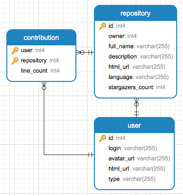

# RisingStack bootcamp

<!-- TOC -->

- [RisingStack bootcamp](#risingstack-bootcamp)
  - [General](#general)
  - [Installation](#installation)
    - [Install Node 8 and the latest `npm`.](#install-node-8-and-the-latest-npm)
    - [Install PostgreSQL on your system](#install-postgresql-on-your-system)
    - [Install Redis on your system](#install-redis-on-your-system)
    - [Install project dependencies](#install-project-dependencies)
    - [Set up your development environment](#set-up-your-development-environment)
  - [Steps](#steps)
    - [1. Create a simple web application and make the test pass](#1-create-a-simple-web-application-and-make-the-test-pass)
    - [2. Create a model for the Github API](#2-create-a-model-for-the-github-api)
    - [3. Implement the database models](#3-implement-the-database-models)
    - [4. Implement helper functions for the database models](#4-implement-helper-functions-for-the-database-models)
    - [5. Create a worker process](#5-create-a-worker-process)
    - [6. Implement a REST API](#6-implement-a-rest-api)
    - [7. Prepare your service for production](#7-prepare-your-service-for-production)

<!-- /TOC -->

## General

  - Always handle errors (at the right place, sometimes it's better to let it propagate)
  - Write unit tests for everything
  - Use [`winston`](https://github.com/winstonjs/winston) for logging
  - Use [`joi`](https://github.com/hapijs/joi) for schema validation (you can validate anything from environment variables to the body of an HTTP request)
  - Leverage [`lodash`](https://lodash.com/docs) and [`lodash/fp`](https://github.com/lodash/lodash/wiki/FP-Guide) functions
  - Avoid callbacks, use [`util.promisify`](https://nodejs.org/api/util.html#util_util_promisify_original) to convert them
  - Read the [You don't know JS](https://github.com/getify/You-Dont-Know-JS) books
  - Use the [latest and greatest ES features](http://node.green/)
  - Follow the [clean coding](https://blog.risingstack.com/javascript-clean-coding-best-practices-node-js-at-scale/) guidelines
  - Enjoy! :)

## Installation

### Install Node 8 and the latest `npm`.

  For this, use [nvm](https://github.com/creationix/nvm), the Node version manager.

  ```sh
  $ nvm install 8
  # optional: set it as default
  $ nvm alias default 8
  # install latest npm
  $ npm install -g npm
  ```

### Install PostgreSQL on your system

  Preferably with [Homebrew](https://brew.sh/).

  ```sh
  $ brew install postgresql
  # create a table
  $ createdb risingstack_bootcamp
  ```

  You should also install a visual tool for PostgreSQL, pick one:
  - [pgweb](https://github.com/sosedoff/pgweb) (`$ brew cask install pgweb`)
  - [postico](https://eggerapps.at/postico/)

### Install Redis on your system

  Preferably with [Homebrew](https://brew.sh/).

  ```sh
  $ brew install redis
  ```

### Install project dependencies

  You only need to install them once, necessary packages are included for all of the steps.

  ```sh
  $ npm install
  ```

### Set up your development environment

  *If you already have a favorite editor or IDE, you can skip this step.*

  1. Download [Visual Studio Code](https://code.visualstudio.com/)
  2. Install the following extensions:
  - [ESLint](https://marketplace.visualstudio.com/items?itemName=dbaeumer.vscode-eslint)
  - [npm](https://marketplace.visualstudio.com/items?itemName=eg2.vscode-npm-script)
  - [npm-intellisense](https://marketplace.visualstudio.com/items?itemName=christian-kohler.npm-intellisense)
  - [Flat UI Theme (optional)](https://marketplace.visualstudio.com/items?itemName=danibram.theme-flatui)
  3. Read the [Node.js tutorial](https://code.visualstudio.com/docs/nodejs/nodejs-tutorial)

## Steps

### 1. Create a simple web application and make the test pass

  Tasks:
  - [ ] Create a `GET` endpoint `/hello` returning `Hello Node.js!` in the response body, use the middleware of the `koa-router` package
  - [ ] Use the `PORT` environment variable to set the port, **make it required**
  - [ ] Make the tests pass (`npm run test-web`)
  - [ ] Run the application (eg. `PORT=3000 npm start` and try if it breaks when `PORT` is not provided)

  Readings:
  - [12 factor - Config](https://12factor.net/config)
  - [Node `process`](https://nodejs.org/api/process.html)
  - [Koa](http://koajs.com/) web framework
  - [Koa router](https://github.com/alexmingoia/koa-router/tree/master)
  - [Mocha](https://mochajs.org/) test framework
  - [Chai](http://chaijs.com/api/bdd/) assertion library

### 2. Create a model for the Github API

  In this step you will implement two functions, wrappers for the GitHub API. You will use them to get information from GitHub later.

  Tasks:
  - [ ] `searchRepositories(query)`: should search for repositories given certain programming languages and/or keywords
    - The `query` function parameter is an `Object` of key-value pairs of the request query parameters (eg. `{ q: 'language:javascript' }`, defaults to `{}`)
    - It returns a `Promise` of the HTTP response without modification
  - [ ] `getContributors(repository, query)`: get contributors list with additions, deletions, and commit counts (statistics)
    - `repository` function parameter is a String of the repository full name, including the owner (eg. `RisingStack/cache`)
    - The `query` function parameter is an `Object` of key-value pairs of the request query parameters (defaults to `{}`)
    - It returns a `Promise` of the HTTP response without modification
  - [ ] Write unit tests for each function, use `nock` to intercept HTTP calls to the GitHub API endpoints

  Readings:
  - [Github API v3](https://developer.github.com/v3)
  - [`request`](https://www.npmjs.com/package/request-promise) & [`request-promise-native`](https://www.npmjs.com/package/request-promise-native) packages
  - [`nock`](https://github.com/node-nock/nock) for mocking endpoints

  Extra:
  - Use the [Github API v4 - GraphQL API](https://developer.github.com/v4) instead

### 3. Implement the database models

  In this step you will create the database tables, where the data will be stored, using migrations.

  Your model should look like this:

  

  It consists of 3 tables: `user`, `repository`, `contribution`. Rows in the `repository` table have foreign keys to a record in the `user` table, `owner`. The `contribution` table is managing many-to-many relationship between the `user` and `repository` tables with foreign keys.

  Tasks:
  - [ ] Edit the config and specify the `migrations` field in the knex initialization `Object`, for example:
    ```js
      {
        client: 'pg',
        connection: '...',
        migrations: {
          directory: path.join(__dirname, './migrations')
        }
      }
    ```
  - [ ] Create one migration file per table (eg. `1-create-user.js`, `2-create-repository.js`, `3-create-contribution.js`) with the following skeleton:
    - `up` method has the logic for the migration, `down` is for reverting it
    - The migrations are executed in transactions
    - The files are executed in alphabetical order
    ```js
    'use strict'

    const tableName = '...'

    function up(knex) {
      return knex.schema.createTable(tableName, (table) => {
        // your code goes here
      })
    }

    function down(knex) {
      return knex.schema.dropTableIfExists(tableName)
    }

    module.exports = {
      up,
      down
    }
    ```
  - [ ] Add a `migrate-db` script to the scripts in `package.json`, edit `scripts/migrate-db.js` to add the migration call. Finally, run your migration script to create the tables:
    ```sh
    $ npm run migrate-db -- --local
    ```

  Readings:
  - [`knex`](http://knexjs.org/) SQL query builder
  - [`knex` migrations API](http://knexjs.org/#Migrations-API)
  - [npm scripts](https://docs.npmjs.com/misc/scripts)

### 4. Implement helper functions for the database models

  In this step you will implement and test helper functions for inserting, changing and reading data from the database.

  Tasks:
  - [ ] Implement the user model: 
    - `User.insert({ id, login, avatar_url, html_url, type })`
      - validate the parameters
    - `User.read({ id, login })`
      - validate the parameters
      - one is required: `id` or `login`
  - [ ] Implement the repository model:
    - `Repository.insert({ id, owner, full_name, description, html_url, language, stargazers_count })`
      - Validate the parameters
      - `description` and `language` can be empty `String`s
    - `Repository.read({ id, full_name })`
      - Validate the parameters
      - One is required: `id` or `full_name`
      - Return the owner as well as an object (join tables and reorganize fields)
  - [ ] Implement the contribution model: 
    - `Contribution.insert({ repository, user, line_count })`
      - Validate the parameters
    - `Contribution.insertOrReplace({ repository, user, line_count })`
      - Validate the parameters
      - Use a [raw query](http://knexjs.org/#Raw-Queries) and the [`ON CONFLICT`](https://www.postgresql.org/docs/9.6/static/sql-insert.html) SQL expression
    - `Contribution.read({ user: { id, login }, repository: { id, full_name } })`
      - Validate the parameters
      - The function parameter should be an Object, it should contain either a user, either a repository field or both of them.

        If only the user is provided, then all the contributions of that user will be resolved.
        If only the repository is provided, than all the users who contributed to that repository will be resolved.
        If both are provided, then it will match the contribution of a particular user to a particular repo.

      - The functions resolves to an Array of contributions (when both a user and a repository identifier is passed, it will only have 1 element)
      - Return the repository and user as well as an object
      (*This requirement is just for the sake of making up a problem, when you actually need this function, you will most likely have the user or the repository Object in a whole*)
        ```js
        {
          line_count: 10,
          user: { id: 1, login: 'coconut', ... },
          repository: { id: 1, full_name: 'risingstack/repo', ... }
        }
        ```
      - Use a **single** SQL query
      - When you join the tables, there will be conflicting column names (`id`, `html_url`). Use the `as` keyword when selecting columns (eg. `repository.id as repository_id`) to avoid this

  Notes:
  - `user` is a reserved keyword in PG, use double quotes where you reference the table in a raw query
  - You can get the columns of a table by querying `information_schema.columns`, which can be useful to select fields dinamically when joining tables, eg.:
    ```sql
    SELECT column_name FROM information_schema.columns WHERE table_name='contribution';
    ```

### 5. Create a worker process

  In this step you will implement another process of the application, the worker. We will trigger a request to collect the contributions for repositories based on some query. The trigger will send messages to another channel, the handler for this channel is reponsible to fetch the repositories. The third channel is used to fetch and save the contributions.

  **Make a drawing of the message flow, it will help you a lot!**

  Tasks:
  - [ ] Start Redis locally
  - [ ] Implement the contributions handler:
    - The responsibility of the contributions handler is to fetch the contributions of a repository from the GitHub API and to save the contributors and their line counts to the database
    - Validate the `message`, it has two fields: `date` and `repository` with `id` and `full_name` fields
    - Get the contributions from the GitHub API (use your models created in step 2)
    - Count all the lines currently in the repository per users (use `lodash` and `Array` functions)
    - Save the users to the database, don't fail if the user already exists (use your models created in step 3)
    - Save the contributions to the database, insert or replace (use your models created in step 3)
  - [ ] Implement the repository handler:
    - Validate the `message`, it has three fields: `date`, `query` and `page`
    - Get the repositories from the GitHub API (use your models created in step 2) with the `q`, `page` and `per_page` (set to 100) query parameters.
    - Modify the response to a format which is close to the database models (try to use [`lodash/fp`](https://github.com/lodash/lodash/wiki/FP-Guide))
    - Save the owner to the database, don't fail if the user already exists (use your models created in step 3)
    - Save the repository to the database, don't fail if the repository already exists (use your models created in step 3)
    - Publish a message to the `contributions` channel with the same `date`
  - [ ] Implement the trigger handler:
    - The responsibility of the trigger handler is to send 10 messages to the `repository` collect channel implemented above. 10, because GitHub only gives access to the first 1000 (10 * page size of 100) search results
    - Validate the `message`, it has two fields: `date` and `query`
  - [ ] We would like to make our first search and data collection from GitHub.
    - For this, create a trigger.js file in the scripts folder. It should be a simple run once Node script which will publish a message to the `trigger` channel with the query passed in as an environment variable (`TRIGGER_QUERY`), then exit. It should have the same `--local`, `-L` flag, but for setting the `REDIS_URI`, as the migrate-db script.
    - Add a `trigger` field to the scripts in `package.json` that calls your `trigger.js` script.

  Readings:
  - [12 factor - Processes](https://12factor.net/processes)
  - [12 factor - Concurrency](https://12factor.net/concurrency)
  - [Redis pub/sub](https://redis.io/topics/pubsub)
  - [`ioredis`](https://github.com/luin/ioredis)

### 6. Implement a REST API

  In this step you will add a few routes to the existing web application to trigger a data crawl and to expose the collected data.

  Tasks:
  - [ ] The database requirements changed in the meantime, create a new migration (call it `4-add-indexes.js`), add indexes to `user.login` and `repository.full_name` (use `knex.schema.alterTable`)
  - [ ] Implement the `POST /api/v1/trigger` route, the body contains an object with a string `query` field, you will use this query to send a message to the corresponding Redis channel. Return `201` when it was successful
  - [ ] Implement the `GET /api/v1/repository/:id` and `GET /api/v1/repository/:owner/:name` endpoints
  - [ ] Implement the `GET /api/v1/repository/:id/contributions`  and `GET /api/v1/repository/:owner/:name/contributions` endpoints
  - [ ] Create a middleware (`requestLogger({ level = 'silly' })`) and add it to your server, that logs out:
    - The method and original url of the request
    - Request headers (except `authorization` and `cookie`) and body
    - The request duration in `ms`
    - Response headers (except `authorization` and `cookie`) and body
    - Response status code (based on it: log level should be `error` when server error, `warn` when client error)
  - [ ] Document your API using [Apiary](https://apiary.io/)'s Blueprint format (edit the `API_DOCUMENTATION.apib`).

  Notes:
  - Make use of [koa-compose](https://github.com/koajs/compose) and the validator middleware
    ```js
    compose([
      middleware.validator({
        params: paramsSchema,
        query: querySchema,
        body: bodySchema
      }),
      // additional middleware
    ])
    ```

  Readings:
  - [Pragmatic RESTful API](http://www.vinaysahni.com/best-practices-for-a-pragmatic-restful-api)
  - [Koa middleware & cascade](http://koajs.com/)
  - [API Blueprint tutorial](https://help.apiary.io/api_101/api_blueprint_tutorial/)

### 7. Prepare your service for production

  In this step you will add some features, which are required to have your application running in production environment.

  Tasks:
  - [ ] Listen on the `SIGTERM` signal in `web/index.js`.
    - Create a function called `gracefulShutdown`
    - Use koa's `.callback()` function to create a `http` server (look for `http.createServer`) and convert `server.close` with `util.promisify`
    - Close the server and destroy the database and redis connections (use the `destroy` function to the redis model, which calls `disconnect` on both redis clients and returns a `Promise`)
    - Log out and exit the process with code `1` if something fails
    - Exit the process with code `0` if everything is closed succesfully
  - [ ] Implement the same for the worker process
  - [ ] Add a health check endpoint for the web server
    - Add a `healthCheck` function for the database model, use the `PG_HEALTH_CHECK_TIMEOUT` environment variable to set the query timeout (set default to `2000` ms)
    - Add a `healthCheck` function to the redis model
    - Implement the `GET /healthz` endpoint, return `200` with JSON body `{ "status": "ok" }`when everything is healthy, `500` if any of the database or redis connections are not healthy and `503` if the process got `SIGTERM` signal
  - [ ] Create a http server and add a similar health check endpoint for the worker process

  Readings:
  - [Signal events](https://nodejs.org/api/process.html#process_signal_events)
  - [Graceful shutdown](https://blog.risingstack.com/graceful-shutdown-node-js-kubernetes/)
  - [Health checks](http://microservices.io/patterns/observability/health-check-api.html)
